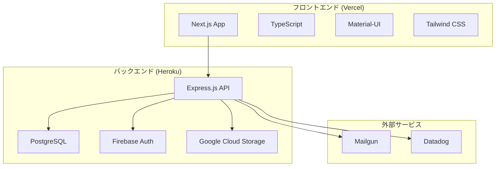

# 🐦 Twitter Clone - フルスタックソーシャルメディアアプリケーション

<div align="center">


**最新技術で構築されたモダンでスケーラブルな Twitter クローン**

[🚀 ライブデモ](https://twitter-clone-frontend.vercel.app) | [📚 API ドキュメント](./API_ENDPOINTS.md) | [🐳 Docker セットアップ](#quick-start)

<div align="center">

### 🎬 デモ動画

<video width="100%" controls></video>

  <source src="https://github.com/yukito-takeuchi/twitter-clone/raw/feature/frontend-setup1/twitter-clone-gif.gif" type="video/mp4">
  お使いのブラウザは動画タグをサポートしていません。
</video>

**📺 動画が表示されない場合**: [デモ動画を直接表示](https://github.com/yukito-takeuchi/twitter-clone/raw/feature/frontend-setup1/twitter-clone-gif.gif)

_実際のアプリケーション動作デモ_

> **📝 デモ動画の追加方法:**
>
> 1. **GitHub Issues を使用**: 新しい Issue を作成し、動画をドラッグ&ドロップでアップロード
> 2. **GitHub Releases を使用**: リリースを作成し、動画をアセットとして添付
> 3. **直接アップロード**: リポジトリに動画ファイルを直接コミット
> 4. **最適化**: 動画は MP4 形式で 10MB 以下に圧縮することを推奨

</div>

</div>

---

## 📋 目次

- [✨ 機能](#-機能)
- [🏗️ アーキテクチャ](#️-アーキテクチャ)
- [🛠️ 技術スタック](#️-技術スタック)
- [🚀 クイックスタート](#-クイックスタート)
- [📱 スクリーンショット](#-スクリーンショット)
- [🔧 開発](#-開発)
- [📊 データベーススキーマ](#-データベーススキーマ)
- [🌐 API エンドポイント](#-api-エンドポイント)
- [🚀 デプロイ](#-デプロイ)
- [📈 パフォーマンス](#-パフォーマンス)
- [🤝 コントリビューション](#-コントリビューション)
- [📄 ライセンス](#-ライセンス)

---

## ✨ 機能

### 🎯 コア機能

- **👤 ユーザー認証** - Firebase Authentication 統合
- **📝 投稿作成** - 画像付きリッチテキスト投稿
- **❤️ ソーシャル機能** - いいね、フォロー、ブックマーク
- **👥 ユーザープロフィール** - アバター付きカスタマイズ可能なプロフィール
- **📱 レスポンシブデザイン** - モバイルファースト、Twitter ライクな UI
- **🔍 リアルタイム検索** - ユーザーと投稿の検索
- **📊 タイムライン** - フォローに基づくパーソナライズされたフィード

### 🚀 高度な機能

- **🖼️ 画像アップロード** - Google Cloud Storage 統合
- **📧 メール通知** - Mailgun 統合
- **📊 アナリティクス** - Datadog 監視
- **🔒 セキュリティ** - JWT 認証、CORS 保護
- **⚡ パフォーマンス** - 最適化されたクエリ、キャッシュ戦略

---

## 🏗️ アーキテクチャ



---

## 🛠️ 技術スタック

### フロントエンド

| 技術             | バージョン | 用途                              |
| ---------------- | ---------- | --------------------------------- |
| **Next.js**      | 14.2.1     | SSR/SSG 対応 React フレームワーク |
| **TypeScript**   | 5.x        | 型安全な JavaScript               |
| **Material-UI**  | 7.3.4      | コンポーネントライブラリ          |
| **Tailwind CSS** | 3.4.1      | ユーティリティファースト CSS      |
| **Firebase**     | 12.4.0     | 認証                              |
| **Axios**        | 1.12.2     | HTTP クライアント                 |

### バックエンド

| 技術           | バージョン | 用途               |
| -------------- | ---------- | ------------------ |
| **Node.js**    | 20.x       | ランタイム環境     |
| **Express.js** | 5.1.0      | Web フレームワーク |
| **PostgreSQL** | 16.x       | メインデータベース |
| **TypeScript** | 5.x        | 型安全な開発       |
| **Docker**     | Latest     | コンテナ化         |

### インフラストラクチャ

| サービス                 | 用途                                   |
| ------------------------ | -------------------------------------- |
| **Vercel**               | フロントエンドホスティング・デプロイ   |
| **Heroku**               | バックエンドホスティング・データベース |
| **Google Cloud Storage** | 画像・ファイルストレージ               |
| **Mailgun**              | メール配信サービス                     |
| **Datadog**              | アプリケーション監視                   |

---

## 🚀 クイックスタート

### 前提条件

- **Node.js** 20+
- **Docker** & Docker Compose
- **Git**

### 1. リポジトリのクローン

```bash
git clone https://github.com/yourusername/twitter-clone.git
cd twitter-clone
```

### 2. 開発環境の起動

```bash
# Dockerですべてのサービスを起動
docker-compose up -d

# サービスの動作確認
curl http://localhost:3001/health
curl http://localhost:3001/health/db
```

### 3. アプリケーションへのアクセス

- **フロントエンド**: http://localhost:3000
- **バックエンド API**: http://localhost:3001
- **データベース**: localhost:5432

### 4. マイグレーションの実行

```bash
# データベーススキーマの適用
cd backend
npm run migrate
```

---

## 📱 アプリケーション画面

<div align="center">

### 🎬 デモ動画

<video width="100%" controls>
  <source src="https://github.com/yukito-takeuchi/twitter-clone/raw/feature/frontend-setup1/twitter-clone-gif.gif" type="video/mp4">
  お使いのブラウザは動画タグをサポートしていません。
</video>

_フル機能デモンストレーション_

### 🖼️ 主要画面

|                 ホームフィード                 |                 ユーザープロフィール                 |                        投稿作成                        |
| :--------------------------------------------: | :--------------------------------------------------: | :----------------------------------------------------: |
|  |  |  |
|        パーソナライズされたタイムライン        |            カスタマイズ可能なプロフィール            |                   リッチテキスト投稿                   |

### 📱 レスポンシブデザイン


_モバイルファーストのレスポンシブデザイン_

</div>

---

## 🔧 開発

### プロジェクト構造

```
twitter-clone/
├── 📁 frontend/                 # Next.jsアプリケーション
│   ├── 📁 src/
│   │   ├── 📁 app/             # App routerページ
│   │   ├── 📁 components/      # 再利用可能なコンポーネント
│   │   ├── 📁 hooks/           # カスタムReactフック
│   │   └── 📁 utils/           # ユーティリティ関数
│   └── 📄 package.json
├── 📁 backend/                  # Express.js API
│   ├── 📁 src/
│   │   ├── 📁 controllers/     # ルートコントローラー
│   │   ├── 📁 models/          # データモデル
│   │   ├── 📁 routes/          # APIルート
│   │   ├── 📁 services/        # ビジネスロジック
│   │   └── 📁 middlewares/      # Expressミドルウェア
│   ├── 📁 migrations/          # データベースマイグレーション
│   └── 📄 Dockerfile
├── 📄 docker-compose.yml       # 開発環境
├── 📄 heroku.yml              # 本番デプロイ
└── 📄 README.md
```

### 利用可能なスクリプト

#### フロントエンド

```bash
cd frontend

npm run dev          # 開発サーバー起動
npm run build        # 本番用ビルド
npm run start        # 本番サーバー起動
npm run lint         # ESLint実行
```

#### バックエンド

```bash
cd backend

npm run dev          # 開発サーバー起動
npm run build        # TypeScriptビルド
npm run start        # 本番サーバー起動
npm run migrate      # データベースマイグレーション実行
```

#### Docker コマンド

```bash
# すべてのサービスを起動
docker-compose up -d

# ログを表示
docker-compose logs -f

# サービスを停止
docker-compose down

# コンテナを再ビルド
docker-compose up -d --build
```

---

## 📊 データベーススキーマ

### コアテーブル

```sql
-- ユーザーテーブル
CREATE TABLE users (
    id UUID PRIMARY KEY,
    firebase_uid VARCHAR(255) UNIQUE NOT NULL,
    email VARCHAR(255) UNIQUE NOT NULL,
    username VARCHAR(50) UNIQUE NOT NULL,
    display_name VARCHAR(100),
    is_active BOOLEAN DEFAULT true,
    created_at TIMESTAMP WITH TIME ZONE DEFAULT NOW(),
    updated_at TIMESTAMP WITH TIME ZONE DEFAULT NOW()
);

-- 投稿テーブル
CREATE TABLE posts (
    id UUID PRIMARY KEY,
    user_id UUID REFERENCES users(id),
    content TEXT NOT NULL,
    image_url TEXT,
    reply_to_id UUID REFERENCES posts(id),
    created_at TIMESTAMP WITH TIME ZONE DEFAULT NOW()
);

-- ソーシャル機能
CREATE TABLE likes (
    id UUID PRIMARY KEY,
    user_id UUID REFERENCES users(id),
    post_id UUID REFERENCES posts(id),
    created_at TIMESTAMP WITH TIME ZONE DEFAULT NOW()
);

CREATE TABLE follows (
    id UUID PRIMARY KEY,
    follower_id UUID REFERENCES users(id),
    following_id UUID REFERENCES users(id),
    created_at TIMESTAMP WITH TIME ZONE DEFAULT NOW()
);
```

### データベース機能

- **UUID 主キー** - グローバル一意識別子
- **外部キー制約** - データ整合性
- **インデックス** - 最適化されたクエリパフォーマンス
- **タイムスタンプ** - 自動作成/更新追跡
- **カスケード削除** - 参照整合性の維持

---

## 🌐 API エンドポイント

### 認証

```http
POST   /api/auth/register     # ユーザー登録
POST   /api/auth/login        # ユーザーログイン
POST   /api/auth/logout       # ユーザーログアウト
GET    /api/auth/me           # 現在のユーザー取得
```

### ユーザー

```http
GET    /api/users             # ユーザー一覧
GET    /api/users/:id         # IDでユーザー取得
GET    /api/users/username/:username  # ユーザー名でユーザー取得
PUT    /api/users/:id         # ユーザー更新
DELETE /api/users/:id         # ユーザー削除
```

### 投稿

```http
GET    /api/posts             # 投稿一覧
POST   /api/posts             # 投稿作成
GET    /api/posts/:id         # IDで投稿取得
PUT    /api/posts/:id         # 投稿更新
DELETE /api/posts/:id         # 投稿削除
GET    /api/posts/timeline/:userId  # ユーザータイムライン取得
```

### ソーシャル機能

```http
POST   /api/likes             # 投稿にいいね
DELETE /api/likes/:id         # いいねを取り消し
POST   /api/follows           # ユーザーをフォロー
DELETE /api/follows/:id       # フォローを解除
GET    /api/follows/:userId   # ユーザーのフォロワー/フォロー中取得
```

### ヘルスチェック・監視

```http
GET    /health                # APIヘルスチェック
GET    /health/db             # データベースヘルスチェック
```

---

## 🚀 デプロイ

### フロントエンド (Vercel)

```bash
# mainブランチへのプッシュで自動デプロイ
git push origin main

# 手動デプロイ
vercel --prod
```

### バックエンド (Heroku)

```bash
# Herokuにデプロイ
git push heroku main

# データベースマイグレーション実行
heroku run npm run migrate

# ログを表示
heroku logs --tail
```

### 環境変数

```env
# バックエンド (.env)
DATABASE_URL=postgresql://...
FIREBASE_PROJECT_ID=your-project-id
FIREBASE_PRIVATE_KEY=your-private-key
FIREBASE_CLIENT_EMAIL=your-client-email
GCS_BUCKET_NAME=your-bucket-name
MAILGUN_API_KEY=your-mailgun-key
MAILGUN_DOMAIN=your-mailgun-domain

# フロントエンド (.env.local)
NEXT_PUBLIC_API_URL=https://your-api.herokuapp.com
NEXT_PUBLIC_FIREBASE_API_KEY=your-firebase-key
NEXT_PUBLIC_FIREBASE_AUTH_DOMAIN=your-domain
```

---

## 📈 パフォーマンス

### 最適化戦略

- **データベースインデックス** - 最適化されたクエリパフォーマンス
- **コネクションプーリング** - 効率的なデータベース接続
- **画像最適化** - Next.js 自動最適化
- **コード分割** - パフォーマンス向上のための遅延読み込み
- **キャッシュ** - セッション管理用 Redis
- **CDN** - 静的アセット用 Vercel グローバル CDN

### 監視

- **Datadog** - アプリケーションパフォーマンス監視
- **Heroku Metrics** - サーバーパフォーマンス追跡
- **Vercel Analytics** - フロントエンドパフォーマンス洞察

---

## 🤝 コントリビューション

コントリビューションを歓迎します！以下の手順に従ってください：

1. **リポジトリをフォーク**
2. **フィーチャーブランチを作成**: `git checkout -b feature/amazing-feature`
3. **変更をコミット**: `git commit -m 'Add amazing feature'`
4. **ブランチにプッシュ**: `git push origin feature/amazing-feature`
5. **プルリクエストを開く**

### 開発ガイドライン

- TypeScript のベストプラクティスに従う
- 包括的なテストを書く
- ドキュメントを更新する
- コンベンショナルコミットに従う

---

## 📄 ライセンス

このプロジェクトは MIT ライセンスの下でライセンスされています - 詳細は[LICENSE](LICENSE)ファイルを参照してください。

---

## 🙏 謝辞

- **Twitter** - インスピレーションと UI/UX デザイン
- **Vercel** - 素晴らしいホスティングプラットフォーム
- **Heroku** - 信頼性の高いバックエンドホスティング
- **Material-UI** - 美しいコンポーネントライブラリ
- **PostgreSQL** - 堅牢なデータベースシステム

---

<div align="center">

**❤️ で構築 by [あなたの名前]**

[](https://github.com/yourusername)
[](https://linkedin.com/in/yourusername)
[](https://twitter.com/yourusername)

</div>
