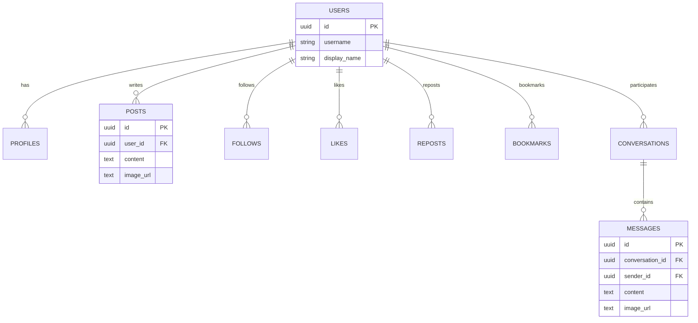

# 🐦 Twitter Clone - フルスタックソーシャルメディアアプリケーション


**最新技術で構築されたモダンでスケーラブルな Twitter クローン**

[🚀 ライブデモ](https://twitter-clone-frontend.vercel.app) | [📚 API ドキュメント](./API_ENDPOINTS.md) | [🐳 Docker セットアップ](#quick-start)

---

## 📺 デモ

<div align="center">


_実際のアプリケーションの動作デモ_

</div>

---

## 🧭 概要（簡潔）

- X(旧 Twitter) 風の SNS。投稿、いいね、リポスト、ブックマーク、DM、通知、プロフィール編集を提供。
- レイアウトは中央寄せ 3 カラム（左:275px / 中央:600px / 右:350px）。
- デプロイ: フロント(Vercel) / バックエンド(Heroku, Docker) / DB(PostgreSQL) / メディア(GCS) / 認証(Firebase)。

## 🛠 技術スタック（最小）

- フロント: Next.js 14 (App Router), TypeScript, Material-UI, Tailwind, Socket.io Client
- バックエンド: Node.js, Express.js, TypeScript, PostgreSQL, Socket.io
- インフラ/外部: Docker, Vercel, Heroku, Google Cloud Storage, Firebase Authentication, Datadog, Mailgun

## ✨ 実装済み機能（要点）

- 認証: Firebase Auth / ログイン・ログアウト / JWT 検証
- 投稿: 作成/閲覧/編集/削除、画像/動画、引用/リプライ、固定、閲覧数
- ソーシャル: いいね、フォロー、リポスト、ブックマーク（一覧）
- プロフィール: 作成/閲覧/編集、アバター/カバー画像（GCS）、総ポスト数
- タイムライン: ホーム/プロフィール、無限スクロール、ページネーション
- DM: 1 対 1、テキスト/画像、既読、未読数、リアルタイム受信、タイピング
- 通知: いいね/フォロー/返信/リポスト/DM、未読数

## 🧪 ユースケース（例）

- タイムラインで投稿を閲覧し、いいね・リポスト・ブックマークする
- 投稿（テキスト/画像）を作成し、リプライや引用で会話を続ける
- DM で画像を含む 1 対 1 のやり取り（既読/未読管理）
- プロフィールを編集し、アバター/カバー画像を更新する

## 🗃 簡易 ER 図



---

## 🔧 開発

### プロジェクト構造

```
twitter-clone/
├── 📁 frontend/ # Next.js アプリケーション
│ ├── 📁 src/
│ │ ├── 📁 app/ # App router ページ
│ │ ├── 📁 components/ # 再利用可能なコンポーネント
│ │ ├── 📁 hooks/ # カスタム React フック
│ │ └── 📁 utils/ # ユーティリティ関数
│ └── 📄 package.json
├── 📁 backend/ # Express.js API
│ ├── 📁 src/
│ │ ├── 📁 controllers/ # ルートコントローラー
│ │ ├── 📁 models/ # データモデル
│ │ ├── 📁 routes/ # API ルート
│ │ ├── 📁 services/ # ビジネスロジック
│ │ └── 📁 middlewares/ # Express ミドルウェア
│ ├── 📁 migrations/ # データベースマイグレーション
│ └── 📄 Dockerfile
├── 📄 docker-compose.yml # 開発環境
├── 📄 heroku.yml # 本番デプロイ
└── 📄 README.md
```

---
